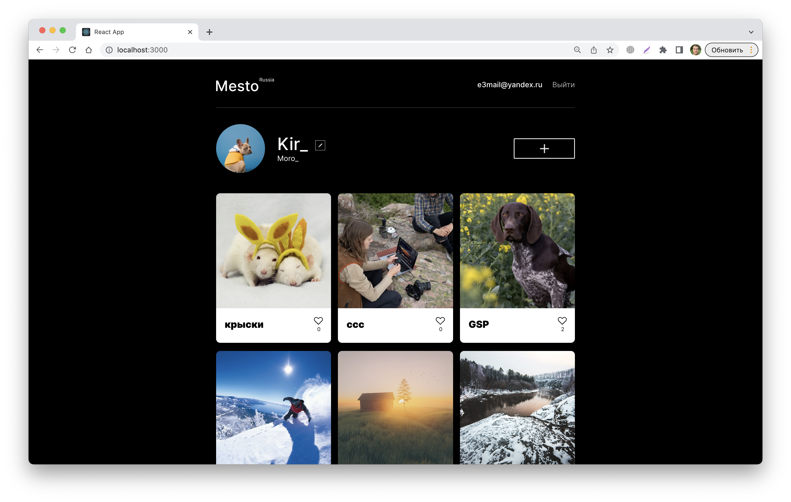

# Приложение «Место + аутентификация»
## Технология ReactJS

### Фукнциональность
React route

Регистрация и авторизация пользователей

Загрузка данных о пользователе и карточек с помощью API

Открытие и закрытие попапов

Установка и снятие лайков

Удаление карточки

### Скриншоты


### Установка
```
Клонировать репозиторий

git clone https://github.com/KirMoro/mesto-react-auth.git

Запустить приложение

npm install
npm start
```

### Планы по доработке проекта
Подключение валидации форм

